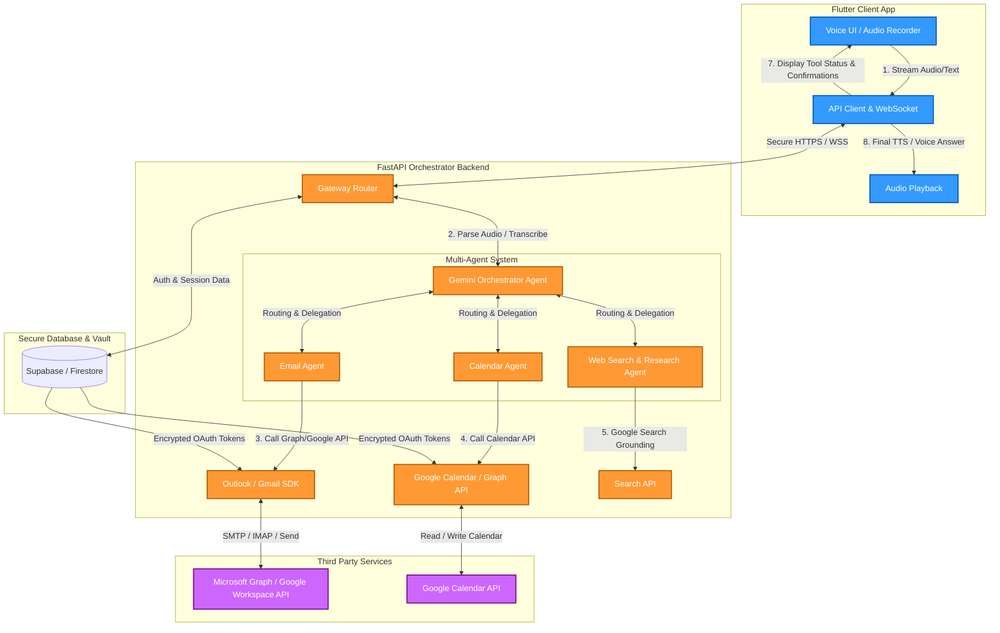

# 🚀 Executive Agent: Multi-Agent Mobile Assistant
> An end-to-end development roadmap and architectural design document for building a voice-controlled, multi-agent productivity assistant for business owners.

Welcome to the development guide for **Executive Agent**! This document breaks down the entire project from a default Flutter counter template into a production-ready, voice-driven multi-agent ecosystem. 

As a busy business owner, the target user wants to press a button, speak naturally, and have the system execute complex tasks (e.g., *"Draft a summary of my last three emails, schedule a sync with Sarah tomorrow morning, and email it to her"*). 

This guide serves as your textbook and checklist to learn **Agentic AI development** from scratch.

---

## 📐 Architecture & Flow

To make this app secure, fast, and scalable, we separate concerns between a **Flutter Mobile Frontend** (which handles UI/UX, voice recording, and native interactions) and a **Python Backend Orchestrator** (which hosts our AI agents, executes tool calls, and integrates with secure APIs).



### Why This Architecture?
* **Security & Tokens**: Mobile apps should not store raw client secrets or perform OAuth token exchanges directly for Microsoft Graph or Google Workspace. Keeping this on a backend using a secure DB vault (like Supabase or Firebase) prevents credential leaks.
* **Agent Orchestration**: Agentic workflows are computationally heavy and require rapid iteration. Writing your agents in Python using the official **Google GenAI SDK** allows you to leverage libraries like `google-genai` and `langchain`/`langgraph` easily.
* **Cross-Platform Delivery**: Flutter ensures your business owner users can run the app on both iOS and Android with a native look and feel.

---

## 🛠️ Technology Stack

| Layer | Technology | Rationale |
|---|---|---|
| **Frontend Framework** | **Flutter (Dart)** | Unified codebase, beautiful animations, native device access (Microphone, local storage). |
| **Backend Framework** | **Python (FastAPI)** | High performance, async support, native compatibility with official Google GenAI SDK. |
| **Agentic AI Engine** | **Gemini 2.0 Flash/Pro via `google-genai`** | Ultra-fast token speeds, native tool calling, multimodal capabilities (direct audio processing), and high context windows. |
| **Database & Auth** | **Supabase** | Built-in authentication, secure PostgreSQL database, Row Level Security (RLS) for user credentials, and encrypted vaults. |

---

## 📦 Directory Structure

Organize your workspace as a monorepo to make local development easier:

```
Mobile AI Agent Development/
│
├── mobile_agent/             # Flutter Frontend (Already exists)
│   ├── lib/
│   │   ├── main.dart         # Entry point
│   │   ├── models/           # Agent states, messages, user profiles
│   │   ├── services/         # API Service, WebSockets, Secure Storage
│   │   ├── views/            # Voice screen, Activity feed, Approvals UI
│   │   └── widgets/          # Voice visualizer, Tool execution cards
│   └── pubspec.yaml          # Flutter dependencies
│
├── backend/                  # Python Backend Orchestrator
│   ├── app/
│   │   ├── __init__.py
│   │   ├── main.py           # FastAPI server entry point
│   │   ├── config.py         # Environment variables & API keys
│   │   ├── agents/           # Core Multi-Agent Logic
│   │   │   ├── coordinator.py# Router/Supervisor Agent
│   │   │   ├── email_agent.py# Email specialist
│   │   │   ├── cal_agent.py  # Calendar specialist
│   │   │   └── web_agent.py  # Research specialist
│   │   ├── tools/            # Python functions exposed to Gemini
│   │   │   ├── email_tools.py
│   │   │   ├── calendar_tools.py
│   │   │   └── search_tools.py
│   │   └── database/         # Supabase client & token manager
│   │       └── db_client.py
│   ├── requirements.txt      # Python dependencies
│   └── Dockerfile            # Container deployment configurations
│
└── GEMINI.md                 # Project roadmap (This file)
```

---

## 🚀 Step-by-Step Implementation Roadmap

### Milestone 1: Local Foundations & Voice Capture (Flutter)
**Objective:** Replace the default counter code with a sleek Voice Interface that records audio and sends requests.

1. **Clean up `pubspec.yaml`**: Add required dependencies:
   ```yaml
   dependencies:
     flutter:
       sdk: flutter
     flutter_riverpod: ^2.5.0       # State management
     record: ^5.0.0                 # High-performance audio recording
     path_provider: ^2.1.0          # Accessing storage paths
     http: ^1.2.0                   # API calls
     web_socket_channel: ^3.0.0     # For real-time streaming audio/text
     flutter_secure_storage: ^9.0.0 # Encrypting tokens on device
     permission_handler: ^11.0.0    # Handle microphone permission popup
     uuid: ^4.0.0                   # Unique event IDs
     google_fonts: ^6.1.0           # Premium UI typography
   ```
2. **Develop the UI Mockups**:
   - Design a minimal, clean voice assistant interface.
   - Add a microphone button that changes state when pressed (Idle -> Recording -> Processing -> Speaking).
   - Use a visualizer effect (like expanding circles or a custom wave indicator) using Flutter's `CustomPainter` or a Lottie animation.
3. **Configure Permissions**:
   - For Android, configure `AndroidManifest.xml` with `<uses-permission android:name="android.permission.RECORD_AUDIO" />`.
   - For iOS, add `NSMicrophoneUsageDescription` to `Info.plist` explaining why the app needs the microphone.
4. **Build the Audio Service**:
   - Write a helper service in Dart to handle audio capturing, exporting to compressed formats (e.g., AAC/M4A), and sending it to a test API endpoint.

---

### Milestone 2: Backend Orchestration & Tool Calling (Python)
**Objective:** Spin up a FastAPI backend that uses Gemini to parse intents and perform basic python tool executions.

1. **Set up Python Environment**:
   Initialize a virtual environment in `backend/` and install requirements:
   ```bash
   cd backend
   python -m venv venv
   # On Windows:
   .\venv\Scripts\activate
   ```
   Install the official Google GenAI package and server tools:
   ```bash
   pip install google-genai fastapi uvicorn pydantic supabase python-dotenv
   pip freeze > requirements.txt
   ```
2. **Create the FastAPI Server**:
   Create a basic endpoint in `backend/app/main.py` that receives files or JSON requests.
3. **Write Your First Agent (The Router)**:
   In `backend/app/agents/coordinator.py`, configure the `google-genai` client:
   ```python
   from google import genai
   from google.genai import types
   import os
   from dotenv import load_dotenv

   load_dotenv()
   client = genai.Client(api_key=os.environ.get("GEMINI_API_KEY"))

   # Define the functions (tools) the agent can execute
   def search_web(query: str) -> str:
       """Searches the internet for the given query and returns a summary."""
       # Integrations will go here (e.g., Google Grounding search or Serper API)
       return f"Web search results for: '{query}' - Synced with today's trends."

   def draft_email(recipient: str, subject: str, body: str) -> str:
       """Drafts an email for a user to review before sending."""
       return f"Drafted email to {recipient} with subject '{subject}'."

   # Initialize Gemini with Tools
   def run_agent_workflow(user_prompt: str):
       response = client.models.generate_content(
           model='gemini-2.0-flash',
           contents=user_prompt,
           config=types.GenerateContentConfig(
               system_instruction="You are Executive Agent. You route user inputs to correct tools.",
               tools=[search_web, draft_email],
               temperature=0.0
           )
       )
       
       # Handle tool execution loop
       # Gemini will automatically output function calls if it matches the user's intent!
       if response.function_calls:
           for call in response.function_calls:
               # Route and execute the actual functions
               if call.name == "search_web":
                   args = call.args
                   result = search_web(args["query"])
                   # Send back to Gemini to formulate final answer
                   return f"Executed Tool: {result}"
               elif call.name == "draft_email":
                   args = call.args
                   result = draft_email(args["recipient"], args["subject"], args["body"])
                   return result
       
       return response.text
   ```

---

### Milestone 3: Integrations & OAuth (The "Hands")
**Objective:** Enable the agents to actually read/write from Outlook, Gmail, and Google Calendar.

> [!WARNING]
> Storing third-party OAuth access/refresh tokens securely is a key safety metric. Ensure you encrypt tokens before writing to your database.

1. **Set up Supabase**:
   - Create a free project on [Supabase](https://supabase.com).
   - Define a table `user_credentials`:
     ```sql
     CREATE TABLE user_credentials (
         user_id UUID REFERENCES auth.users ON DELETE CASCADE,
         provider TEXT NOT NULL, -- 'microsoft', 'google'
         access_token TEXT NOT NULL,
         refresh_token TEXT NOT NULL,
         expires_at TIMESTAMP WITH TIME ZONE NOT NULL,
         PRIMARY KEY (user_id, provider)
     );
     ```
   - Enable Row Level Security (RLS) so users can only access their own credentials.
2. **Microsoft Graph & Google Workspace Setup**:
   - Set up applications in Azure Portal (App Registrations) and Google Cloud Console.
   - Configure OAuth redirect URIs to your backend server (`https://yourbackend.com/auth/callback`).
3. **Build Authentication Flow**:
   - Add OAuth login buttons in the Flutter App (using `url_launcher` or `flutter_web_auth`).
   - The user signs in, and the backend captures the access/refresh tokens, storing them securely in the database.
4. **Implement Email & Calendar Tools**:
   - Replace placeholder functions in Python with real library calls:
     - **Microsoft Outlook**: Use `MSAL` library and make standard REST calls to `https://graph.microsoft.com/v1.0/me/messages` / `sendMail`.
     - **Google Calendar**: Use `google-api-python-client` with your stored OAuth credentials.

---

### Milestone 4: Human-in-the-Loop & Streaming (The UX Safety Net)
**Objective:** Introduce user approvals for destructive actions and stream agent logs to the UI.

> [!IMPORTANT]
> A business owner does *not* want an AI agent to send an email or make a calendar invite without a quick sanity check. We must enforce a **Human-in-the-Loop** model.

1. **Define Status and Approval Contracts**:
   - Instead of completing the action automatically, the agent will call `stage_email` instead of `send_email`.
   - The backend returns a structured JSON payload:
     ```json
     {
       "type": "approval_required",
       "action": "send_email",
       "data": {
         "to": "investor@example.com",
         "subject": "Q2 Financial Review",
         "body": "Hi, please find attached the spreadsheet for Q2 review..."
       }
     }
     ```
2. **Create the Approval Widgets in Flutter**:
   - When the client receives an `approval_required` packet, pause the conversation stream.
   - Show a sliding drawer or card containing the drafted email text.
   - Provide "Send Now" and "Edit First" buttons. Clicking "Send Now" returns a confirmed API payload back to the backend tool execution loop.
3. **Real-time Live Activity Logs**:
   - Use WebSockets (`FASTAPI WebSocket` <--> `Flutter WebSocketChannel`) to stream logs of what the agent is doing.
   - Show micro-status messages on screen in real-time, such as:
     - 🔍 *Searching internet for "S&P 500 historical returns"...*
     - ✍️ *Drafting reply based on search...*
     - 🚦 *Awaiting your approval to send mail.*

---

### Milestone 5: Voice Output & Polishing (TTS)
**Objective:** Add Speech synthesis so the user can listen to responses on the go.

1. **Voice synthesis integrations**:
   - Use the high-fidelity voices provided by Google Text-to-Speech (TTS) or OpenAI's TTS API.
   - The backend can generate the audio response asynchronously and stream the bytes to Flutter, or Flutter can play it from a temporary URL.
2. **Offline Mode**:
   - Implement basic on-device validations (e.g., check internet connection status, and show clean error boundaries if offline).

---

## 📈 Learning Resources

As you start learning Agentic AI, keep these concepts in mind:
* **Function Calling (Tool Use)**: This is the core mechanism of agents. You do not write `if/else` checks for when to call an API. Instead, you declare the tools to the model, and Gemini returns *structured arguments* telling you which tool to run. You run it, feed the output back to the model, and it produces a response.
* **Prompt Engineering**: System instructions dictate how carefully your agent runs. Be precise with your context prompts.
* **Official SDK**: Always refer to the new Google GenAI SDK documentation: [Google GenAI Python SDK](https://github.com/googleapis/google-genai) / [Gemini API Docs](https://ai.google.dev/).

---

## 📋 Comprehensive Checklist

Use this checklist as your roadmap to build **Executive Agent** step-by-step:

- [ ] **Milestone 1: Flutter Skeleton**
  - [ ] Initialize the workspace structure.
  - [ ] Clean up default boilerplate counter code.
  - [ ] Configure `pubspec.yaml` with state management (Riverpod), audio recorder, secure storage, and network dependencies.
  - [ ] Implement UI mockups for Voice Recording Screen (Mic button, waveforms, activity card).
  - [ ] Request and handle microphone permissions natively on Android & iOS.
  - [ ] Build a service to record high-quality audio files locally.

- [ ] **Milestone 2: Backend Groundwork**
  - [ ] Set up Python virtual environment and configure `requirements.txt`.
  - [ ] Implement FastAPI server running with `uvicorn`.
  - [ ] Initialize Google GenAI client (`google-genai` SDK) using environment variables.
  - [ ] Build basic pipeline: User text/audio request -> Backend -> Gemini response -> Flutter UI.
  - [ ] Write your first Python tools (e.g., Simple Math, Weather, Mock Search) and registers them to Gemini.
  - [ ] Test Gemini executing those tools based on natural language queries (e.g. *"Should I wear a coat in Seattle?"*).

- [ ] **Milestone 3: Database & Integrations**
  - [ ] Set up a Supabase database instance.
  - [ ] Implement Table Schema for secure user profile, credentials, and OAuth tokens.
  - [ ] Implement OAuth 2.0 flow for Google Workspace (Gmail / Calendar).
  - [ ] Implement OAuth 2.0 flow for Microsoft Graph (Outlook / Exchange).
  - [ ] Create Python integration service for reading emails and drafting replies.
  - [ ] Create Python integration service for searching current time slots and reserving calendar invites.

- [ ] **Milestone 4: Human-in-the-Loop Orchestration**
  - [ ] Establish WebSocket architecture for streaming updates from backend to Flutter client.
  - [ ] Implement step-by-step log streaming (e.g., showing user each tool run action).
  - [ ] Integrate user approval step into the tool execution loops.
  - [ ] Design and build Flutter interactive UI widgets for staging/modifying drafts, contacts, and calendar timings.
  - [ ] Build fallback handler if user cancels or edits a draft.

- [ ] **Milestone 5: Advanced & Polish**
  - [ ] Hook up Text-to-Speech service (TTS) to read out agent summaries.
  - [ ] Implement audio stream playback on the Flutter client.
  - [ ] Add smooth transitions, dark mode styling, and animations to represent agent thinking.
  - [ ] Deploy FastAPI backend to a serverless platform (e.g., Google Cloud Run or Render).
  - [ ] Write integration tests for token renewal and core agent loop robustness.

---

### Getting Help
If you get stuck or want help implementation any of the components above, ask me (Antigravity):
* *"Help me write the Python code for Google Workspace OAuth flow"*
* *"Generate the code for the audio visualizer in Flutter"*
* *"How do I test my coordinate routing agent locally?"*

Let's turn this vision into a reality! 🚀
